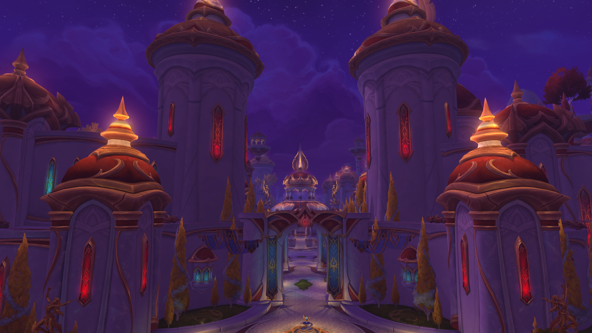

# Classic Music: Midnight



Classic Music: Midnight brings the atmosphere of Vanilla and The Burning
Crusade into Retail's Midnight zones. Each supported area receives one
hand-matched Blizzard SoundKit, including day and night variants where an
appropriate historical counterpart exists.

The addon includes no music files, streams nothing, and modifies no game files.
It only plays music already installed with World of Warcraft.

> New Silvermoon. Classic soul.

> **0.9.0 is a public beta.** Reports from zones, instances, phases, and audio
> configurations that have not yet received broad testing are welcome.

## Features

- Fixed, thematic Vanilla or Burning Crusade music for supported Midnight areas
- Day/night music selected from WoW realm time
- Native-style behavior that follows WoW's Loop Music, Music, and Sound settings
- Smooth sequential transitions when the area's music identity changes
- Support for Midnight outdoor zones, dungeons, raids, delves, lairs, and 12.1 content
- Native `Options > AddOns` settings with immediate category toggles
- Safe restoration of Blizzard music outside supported content and during cinematics
- No custom player, minimap button, bundled audio, or continuously running polling

## Supported content

- Eversong Woods, Silvermoon, the Arcantina, Quel'Danas, Zul'Aman, Harandar,
  Voidstorm, Val, Naigtal, and their verified phase maps
- All nine Midnight dungeons through Altar of Fangs
- The Voidspire, March on Quel'Danas, The Dreamrift, Sporefall, and The
  Venomous Abyss
- Launch delves plus Ring of Glory, Gnarldor Isle, Venomfall Deeps, and the
  current Midnight lair instance
- Coiled Isle and verified 12.1 subcontent

Locations are matched by numeric UI map and instance IDs. An unrecognized map
is intentionally left to Blizzard music until its IDs and theme are verified.

## Installation and quick start

1. Install through CurseForge, or place the `BetterMusic` folder in
   `_retail_/Interface/AddOns/`.
2. Enable **Classic Music: Midnight** at the character-select AddOns screen.
3. Enter supported Midnight content with WoW Music and Sound enabled.
4. Open `Options > AddOns > Classic Music: Midnight`, or type `/bettermusic`.

## Commands

- `/bettermusic` opens the native AddOns settings category.
- `/bettermusic toggle` toggles music and dialogue together while treating
  addon playback as music-on. Use this command in a macro instead of changing
  `Sound_EnableMusic` directly.
- `/bettermusic next` restarts the current area's assigned track.
- `/bettermusic status` reports the active playlist and track.
- `/bettermusic restore` stops addon playback and restores the captured WoW
  music setting. The current location remains suppressed until content changes.
- `/bettermusic debug` prints safe map ancestry and instance data for mapping
  verification.

Suggested macro:

```text
/bettermusic toggle
```

## Native audio behavior

Classic Music: Midnight runs only when both WoW Music and all Sound were enabled.
While an addon SoundKit is playing, it temporarily suppresses Blizzard's zone
music and remembers the prior value. That value is restored on exit, disable,
cinematic, movie, loading screen, logout, reload, or playback failure, provided
the player has not independently changed it.

Every mapped zone or instance has one fixed Classic or Burning Crusade musical
identity. Direct historical matches take priority; locations without a literal
predecessor use one fixed thematic counterpart. If that SoundKit cannot play,
Blizzard music is restored.

Outdoor and city profiles with verified day/night SoundKits use realm time. Day
runs from 5:30 a.m. through 8:59 p.m.; night runs from 9:00 p.m. through 5:29
a.m. A playing track is never cut off only because the boundary passes. The
appropriate variant is selected the next time playback begins.

When a mapped zone changes to a different music identity, the addon fades the
old SoundKit out over 1.25 seconds before starting the new one. Retail's SoundKit
API does not expose a true fade-in or mutable handle volume, so this uses a clean
sequential handoff rather than overlapping full-volume tracks.

Volume-slider changes are debounced. Dragging across several steps produces one
quiet internal restart after the slider settles and does not print another Now
Playing announcement.

The addon follows WoW's **Options > System > Audio > Loop Music** setting. With
looping enabled, the assigned music repeats. With looping disabled, the track
finishes and waits until the player enters another area. Turning Loop Music on
while waiting resumes playback immediately.

## Compatibility and limitations

- Retail Midnight only; Classic and Burning Crusade describe the source music,
  not supported clients.
- Another manual Master-channel music player can overlap addon playback because
  WoW has no universal player-ownership protocol.
- Sound-device resets caused by some system or driver configurations can stop
  addon-created sounds. The addon attempts to resume the same area after WoW's
  device update settles, but background playback still depends on WoW's own
  **Sound in Background** setting and the operating system audio device.
- The addon coexists with Times Change and does not alter cinematic frames.
- Unrecognized future Midnight maps deliberately retain Blizzard music.

## Beta reports

Use [GitHub Issues](https://github.com/stromboli78/ClassicMusic-Midnight/issues).
For a music or mapping problem, include the zone/activity, realm time, current
track, what you expected, and the safe output from `/bettermusic debug`.

Enable Lua errors with `/console scriptErrors 1`, then `/reload`. SoundKit
availability and full-track callbacks must be auditioned in the live client;
static checks cannot play game audio.

## License and trademarks

The addon source is Copyright (c) 2026 stromboli78 and released under the
[MIT License](LICENSE).

World of Warcraft, its names, music, and game assets are trademarks or property
of Blizzard Entertainment. This is an independent fan-made addon and is not
endorsed by or affiliated with Blizzard Entertainment. No Blizzard audio is
distributed with this repository or its release archives.
